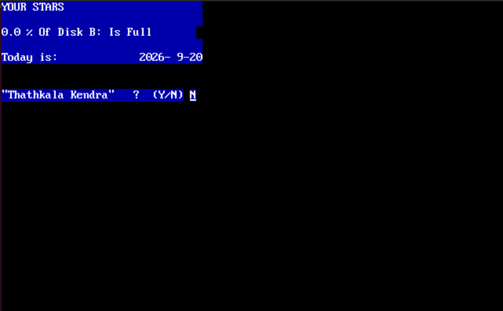

# Modern STAR — Sri Lankan Vedic Astrology Engine

A cross-platform (Linux, macOS, Windows) C++ console application
computing Sri Lankan Vedic horoscopes. It began as a
reverse-engineering port of a 16-bit MS-DOS program (`STAR.EXE`) —
that port is complete and frozen. Current work is product development
on top of a verified core: corrected spellings, responsive layout,
interactive input, color themes, and a second Swiss-Ephemeris engine.

See `NOTICE.md` for provenance and `docs/quirks.md` for the
deliberately reproduced behaviors of the original program.

## The original program

The 16-bit DOS program this port replaces:



### Running the original

To run the actual DOS binary (e.g. side-by-side comparison), use
[DOSBox-X](https://github.com/joncampbell123/dosbox-x) with the
archived copy at `legacy/STAR.EXE`:

```bash
dosbox-x legacy/STAR.EXE
```

## Requirements

- C++20 compiler (GCC, Clang, or MSVC 2022+) plus a C compiler,
  CMake >= 3.16; all builds are 64-bit (enforced by the build)
- Python 3 (test-gate harness only: `extraction_check`, `corpus`)
- Swiss Ephemeris v2.10.3final sources, vendored under
  `third_party/` (Moshier fallback; no downloads, no data files)
- A UTF-8 terminal for `--display modern` (no ASCII fallback)
- Optional: static libc for a portable binary
  (`cmake -S . -B build -DSTAR_PORTABLE=ON`, Linux)
- Optional: Python 3.9+ dev headers plus pip-installed `nanobind`
  for the `pystar` bindings (`-DSTAR_PYTHON=ON`, e.g.
  `-DPython_EXECUTABLE=/usr/bin/python3.13`)

## Build

```bash
cmake -S . -B /tmp/star-build && cmake --build /tmp/star-build
```

Portable standalone binary (fully static, Linux):

```bash
cmake -S . -B /tmp/star-port -DSTAR_PORTABLE=ON && cmake --build /tmp/star-port
```

Python bindings (optional, off by default):

```bash
cmake -S . -B /tmp/star-py -DSTAR_PYTHON=ON -DPython_EXECUTABLE=/usr/bin/python3.13
cmake --build /tmp/star-py --target pystar
PYTHONPATH=/tmp/star-py python3.13 bindings/smoke.py
```

Quick app-only build (Linux; `-ldl` is Linux-only):

```bash
g++ -std=c++20 -O2 -Wall -Wextra -Isrc -Ithird_party/swisseph \
  src/main.cpp src/CLI.cpp src/VargaEngine.cpp src/SwissFeed.cpp \
  third_party/swisseph/swe*.c -lm -ldl -o modern_star
```

## Test gate (run every time)

```bash
ctest --test-dir /tmp/star-build
/tmp/star-build/modern_star --verify   # must end VERIFY_ALL_GREEN
```

Zero warnings under `-Wall -Wextra` is required, not aspirational. A step
that reduces passing tests is a bug in that step — revert and re-approach.

## Binaries

Download-and-run, no install — like the original STAR.EXE:

- **Windows**: download `star.exe`, double-click (a console opens).
  SmartScreen will flag the unknown publisher once — choose Run anyway.
- **Linux**: download `star_linux`, `chmod +x star_linux`, run it
  (fully static binary).
- **macOS**: download `star.dmg`, double-click, drag into
  Applications. Unsigned, so on first launch right-click the app
  and choose Open (Gatekeeper one-time approval).

Tagged versions (`v*`) build all three via
`.github/workflows/release.yml`, published as GitHub Releases.
Windows builds use MSVC (VS2022 x64, static CRT — no redistributable
needed).

## Usage

With no options, the program prompts for every field (no defaults —
every input is validated):

```bash
./modern_star
```

Batch/scripting flags (see `./modern_star --help` for the full list):

```bash
./modern_star --name "Test User" --year 2000 --month 8 --day 17 \
  --hour 14 --minute 5 --city 7 --nirayana
```

Key options:

- `--city <1-26>` — closest district (all 25 districts covered;
  `>26` takes manual coordinates, as in the original).
- `--display modern|legacy` — corrected redesign (default) vs byte-exact
  original (verification runs only). Modern changes words/layout only;
  every number is proven equal to legacy output.
- `--engine dos|swisseph` — clean-math Swiss Ephemeris feed (default)
  vs frozen DOS reconstruction. `--verify` and the corpus always
  pin DOS.
- `--locale en|si|ta` — output locale (default `en`; si/ta fall back
  to English per string until translated).
- `--color auto|always|never` — headings color (`NO_COLOR` respected;
  never emitted into pipes/files).
- `--screen <n[,n...]>` — show only output group N (1–14).
- `--format <text|json>`, `--output <file>`, `--config <file>`.
- `--verify` — checkpoint verification, exit non-zero on failure.
- `--thathkala` — Thathkala Kendra mode (current time, Colombo fallback).

## Python bindings

`pystar.horoscope(...)` returns a `star-horoscope/1` JSON document
(see `docs/json_schema.md`), parsed with stdlib `json`:

```python
import json, pystar
doc = json.loads(pystar.horoscope("Test User", 2000, 8, 17, 14, 5, 7))
print(doc["longitudes"]["Lagna"], doc["engine"])
```

Only the engine is shared — Python is a pure schema consumer.
Translator files live in `src/locale_si.inc` / `src/locale_ta.inc`.

## Docs

- `docs/quirks.md` — original-program behaviors reproduced on purpose.
- `docs/glossary.md` — Old→New spelling table (modern display).
- `docs/modern_display.md` — palette and layout rules.
- `docs/plans.md` — phased roadmap (publish → engines →
  localization → JSON consumers → multi-tradition).
- `docs/json_schema.md` — frozen `star-horoscope/1` JSON schema.
- `docs/status_and_plans.md` — session history log (append-only).

## Contributing

See `CONTRIBUTING.md`. The one rule: `tests/screens/`,
`tests/corpus/`, and `tests/screen_test/` are the contract — golden
files change only by explicit re-baselining with recorded justification,
never edited to match new code.

## License

GNU Affero General Public License v3.0 — see `LICENSE` (full text).
Provenance statement: `NOTICE.md`.
